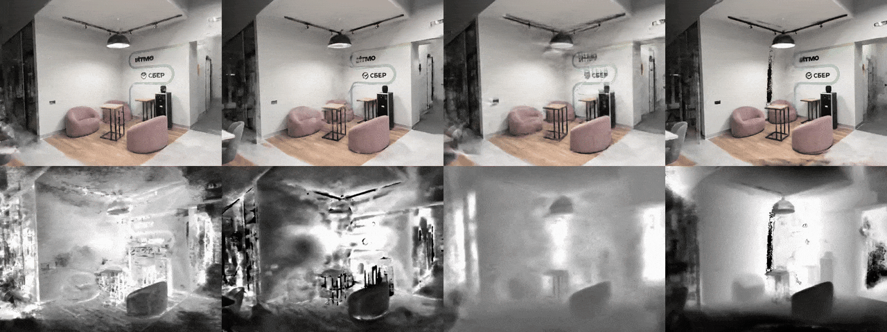
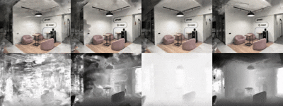

# Depth-NeRF: Improving NeRF Training Quality with Depth Information

> **Course Project for "Machine Learning in Robotics"**  
> **Research Topic**: *Investigating and Comparing Strategies for Incorporating Depth Data into Neural Radiance Fields under Sparse View Conditions*

## Participants
- Artyom Oganesyan
- Polina Popova
- Semynin Aleksandr

## Research Overview

This project investigates how **depth information** can improve NeRF training when only **few input views** are available (e.g., 3 views of a scene). Standard NeRF suffers from geometry ambiguity and slow convergence in such settings.

We compare **two distinct depth integration strategies**, all implemented within a unified NeRF codebase to ensure fair comparison:

### Methods Used

#### 1. **SparseNeRF (Depth as a Ranking Regularization)**
- **Idea**: Uses monocular depth predictions (from DPT) not as ground truth, but as a **relative depth ranking** signal.
- **Implementation**: Adds two losses:
  - `λ_rank`: enforces correct ordering of sample points along a ray.
  - `λ_cont`: encourages smoothness in depth transitions.
- **Advantage**: Robust to absolute depth errors; works even with noisy depth maps.

#### 2. **DS-NeRF (Depth as Hard Supervision)**
- **Idea**: Treats depth maps as **ground-truth supervision** during training.
- **Implementation**: Adds an L1 loss between predicted depth (via expected termination point) and input depth map.
- **Assumption**: Input depth is reasonably accurate (e.g., from COLMAP).

#### 3. **HashNeRF (Efficient Encoding + Implicit Depth)**
- **Idea**: Uses **instant-ngp-style hash encoding** for fast feature lookup, which implicitly captures geometric structure.
- **Implementation**: No explicit depth loss; geometry emerges from high-frequency encoding + sparse views.
- **Note**: Serves as a strong **depth-free baseline** to assess the true value of depth signals.

#### 4. **DDP-NeRF (Dense Depth Priors with Uncertainty)**
- **Idea** Leverages dense depth priors with uncertainty estimates derived from sparse SfM reconstructions to guide NeRF optimization.
- **Implementation**: Uses a depth completion network to convert sparse SfM points into dense depth maps with per-pixel uncertainty; incorporates both as constraints during training via Gaussian negative log likelihood loss and uncertainty-aware sampling.
- **Advantage**: More robust to SfM outliers and sparse input views; provides better geometry recovery in textureless regions while maintaining flexibility where depth estimates are uncertain.

All methods share the same ray sampling, network architecture (except hash encoding), and dataset preprocessing — ensuring a controlled comparison.

---

## Results

Below are the qualitative and quantitative results obtained on the our custom dataset with different input views.

Results with 3 views for HashNeRF, DS-NeRF, SparseNeRF and DDP-NeRF(from left to right)
<div align="center">
  
  <br>
  <em>Comparison of different methods trained with only 3 input views</em>
</div>
<div align="center">
  
  <br>
  <em>Comparison of different methods trained with 9 input views</em>
</div>

### Metrics

All results are evaluated on test views using standard metrics.

### PSNR (dB) ↑ - Higher is Better
| Method       | 2 Views | 3 Views | 5 Views | 9 Views |
|--------------|---------|---------|---------|---------|
| **HashNeRF**     | 14.43   | 23.47   | 24.35   | 24.32   |
| **DS-NeRF**      | 20.73   | 23.16   | 24.04   | 23.96   |
| **SparseNeRF**   | 16.19   | 23.92   | **25.68**   | 24.72   |
| **DDP-NeRF**     | **21.89**   | 22.40   | 24.71   | 23.73   |

### SSIM ↑ - Higher is Better  
| Method       | 2 Views | 3 Views | 5 Views | 9 Views |
|--------------|---------|---------|---------|---------|
| **HashNeRF**     | 0.8495  | 0.8502  | 0.8651  | 0.8647  |
| **DS-NeRF**      | 0.8453  | **0.8517**  | 0.8641  | 0.8593  |
| **SparseNeRF**   | **0.8594**  | 0.8528  | 0.8626  | 0.8586  |
| **DDP-NeRF**     | 0.8344  | 0.8367  | **0.8713**  | 0.8588  |

### LPIPS ↓ - Lower is Better
| Method       | 2 Views | 3 Views | 5 Views | 9 Views |
|--------------|---------|---------|---------|---------|
| **HashNeRF**     | 0.1405  | 0.1182  | 0.1172  | 0.1045  |
| **DS-NeRF**      | 0.1311  | 0.1059  | 0.1024  | 0.1014  |
| **SparseNeRF**   | **0.1095**  | **0.0959**  | 0.1040  | **0.0947**  |
| **DDP-NeRF**     | 0.1563  | 0.1505  | **0.0863**  | 0.0876  |

---

### Key Observations:
- **SparseNeRF** achieves the best PSNR with 2 and 5 views, demonstrating excellent geometry recovery under extreme sparsity
- **DDP-NeRF** shows strongest performance with 5 views (best PSNR and SSIM), benefiting from dense depth priors when sufficient input is available
- **SparseNeRF** consistently achieves the lowest LPIPS scores across all view counts, indicating superior perceptual quality
- **HashNeRF** provides stable baseline performance that improves steadily with more input views
- **DS-NeRF** shows competitive results with balanced performance across all metrics

> **Note**: All methods were evaluated on the same cowork2 scene with identical hyperparameters. Results represent mean values over multiple test views.

---
## Project Structure
```
Depth-NeRF/
│
├── README.md                              ← Full project documentation
├── render.sh                              ← Rendering script
├── requirements.txt                       ← Python dependencies 
├── .gitignore                             ← Excludes logs, cache, weights, IDE files
├── train.sh                               ← Training script
├── run_nerf.py                            ← Main training/inference script
├── run_nerf_helpers.py                    ← Helper functions for NeRF
│
├── configs/                               ← Configuration files for all methods
│   ├── fern_3v.txt                        
│   ├── fern_3v_ds.txt                     
│   └── ....                  
│
├── scripts/                               ← Utility & data preparation scripts
│   ├── download_dataset.py                ← Downloads datasets (lego, fern, etc.)
│   ├── imgs2poses.py                      ← Runs COLMAP to estimate camera poses
│   ├── download_weights.py                ← Downloads DPT weights into ./weights/
│   ├── compare_all_methods.py             ← Compares results from all methods
│   ├── download_lego_dataset.sh           ← Helper script for LEGO dataset
│   ├── eval.py                            ← Evaluation script
│   ├── eval_metrics_script.py             ← Computes PSNR, SSIM, LPIPS metrics
│   └── install_deps.py                    ← Installs system dependencies
│
├── data/                                  ← EMPTY by default (datasets downloaded here)
│   └── (populated after: python scripts/download_dataset.py --dataset fern)
│
├── results/                               ← EMPTY by default; save your outputs here
│   ├── videos/                            ← Rendered comparison videos
│   ├── depth_maps/                        ← Predicted depth visualizations
│   └── metrics/                           ← PSNR, SSIM, LPIPS, etc.
│
├── colmap_utils/                          ← COLMAP
│   ├── __init__.py
│   ├── read_write_model.py
│   └── pose_utils.py
│
├── DPT/                                   ← [Kept as-is] DPT monocular depth model
│   ├── dpt.py
│   ├── transforms.py
│   └── ... (other DPT source files)
│
├── llff/                                  ← LLFF data loader & processing
│   ├── poses.py                           ← LLFF pose utilities
│   └── ...                                ← Other LLFF utilities 
│
├── load_dataset/                          ← Dataset loading logic
│   ├── __init__.py
│   ├── load_llff.py                       ← LLFF dataset loader
│   └── data.py
│
├── losses/                                ← Custom loss functions
│   ├── sparse_depth_loss.py               ← Sparse depth ranking loss
│   └── loss.py                            ← Base loss implementations
│
├── utils/                                 ← Helper functions
│   ├── ray_utils.py                       ← Ray sampling utilities
│   ├── dpt_utils.py                       ← DPT integration utilities
│   ├── camera_pose_visualizer.py          ← Camera pose visualization
│   ├── hash_encoding.py                   ← Hash grid encoding
│   ├── optimizer.py                       ← Custom optimizers
│   └── radam.py                           ← RAdam optimizer implementation
│
└── weights/                               ← Pretrained model weights 
    └── dpt_hybrid-midas-501f0c75.pt       ← Downloaded by scripts/download_weights.py
```

## Installation and Setup

### System Requirements
- OS: Windows / Linux / macOS
- GPU: NVIDIA GPU (recommended for training; CPU works for inference)
- Python ≥ 3.8

### Step-by-Step Installation

1. **Clone the repository**
```bash
   git clone https://github.com/plnppvsln/Depth-NeRF.git
   cd Depth-NeRF
```
2. **Create a virtual environment (recommended)**
```bash
  python -m venv venv
  source venv/bin/activate    # Linux/macOS
  venv\Scripts\activate       # Windows
```
3. **Install Python dependencies**
```bash
  pip install -r requirements.txt
```

### Running the Project

1. **Download a Dataset**
The project includes a convenient script to download pre-processed NeRF datasets.

#### List Available Datasets

To see all available datasets:

```bash
python scripts/download_dataset.py --list
```

This will display all available datasets that can be downloaded.

#### Download a Dataset

To download a specific dataset:

```bash
python scripts/download_dataset.py --dataset <dataset_name>
```

For example:

```bash
python scripts/download_dataset.py --dataset lego
python scripts/download_dataset.py --dataset fern
```

#### Available Datasets

- `shaving_set`
- `lego`
- `fern`
- `fox`

#### Custom Save Directory

By default, datasets are saved to the `./data` directory. You can specify a custom directory:

```bash
python scripts/download_dataset.py --dataset lego --save_dir /path/to/custom/directory
```

**Note:** The default save directory (`./data`) is recommended as it matches the expected project structure.

#### Help

For more information, run:
```bash
python scripts/download_dataset.py --help
```
2. **Download a Weight**
Download weight:
```bash
python scripts/download_weights.py
```

3. **Running COLMAP**

COLMAP is used to estimate camera poses from a set of images. This is necessary for custom datasets or when poses are not pre-computed.

#### Prerequisites

COLMAP will be automatically downloaded on Windows if not found. On Linux/Mac, you can either:
- Install COLMAP system-wide: `sudo apt-get install colmap` (Linux) or `brew install colmap` (Mac)
- Set the `COLMAP_BINARY` environment variable to point to your COLMAP installation
- Place a COLMAP binary in `external/colmap/`

#### Running COLMAP on a Scene

To process images and generate camera poses, use the `imgs2poses.py` script:

```bash
python scripts/imgs2poses.py <scene_directory>
```

For example:

```bash
python scripts/imgs2poses.py data/nerf_llff_data/fern
python scripts/imgs2poses.py data/nerf_custom/fox
```

### Directory Structure

The scene directory should have the following structure:

```
scene_directory/
  └── images/
      ├── image1.jpg
      ├── image2.jpg
      └── ...
```

#### Match Types

You can specify the matching algorithm using the `--match_type` parameter:

- `exhaustive_matcher` (default): Best for unordered image collections
- `sequential_matcher`: Best for video sequences or ordered images

```bash
python scripts/imgs2poses.py --match_type sequential_matcher <scene_directory>
```

#### Removing Unregistered Images

By default, all images are kept in the `images/` directory, even if COLMAP couldn't register them. However, if you want to automatically remove unregistered images to avoid mismatches between images and poses, you can use the `--remove-unregistered` flag:

```bash
python scripts/imgs2poses.py --remove-unregistered <scene_directory>
```

This will delete any images from the `images/` directory that are not listed in `view_imgs.txt` (i.e., images that COLMAP couldn't register). This is useful to prevent errors when loading data, as the number of images will match the number of poses in `poses_bounds.npy`.

#### Output

After running COLMAP, the following files will be created in your scene directory:

- `database.db`: COLMAP feature database
- `sparse/0/`: Sparse reconstruction containing camera poses
  - `cameras.bin`: Camera parameters
  - `images.bin`: Image poses and metadata
  - `points3D.bin`: 3D point cloud
- `poses_bounds.npy`: Processed poses in NeRF format
- `colmap_output.txt`: COLMAP processing logs
- `view_imgs.txt`: List of successfully registered images

The script will automatically skip COLMAP if the sparse reconstruction already exists.

**Note:** COLMAP may not be able to register all images in your dataset (e.g., due to insufficient features, poor image quality, or lack of overlap). The pose processing pipeline has been updated to handle this gracefully by using only the images that were successfully registered by COLMAP. The `view_imgs.txt` file contains the list of images that were successfully processed, and the `poses_bounds.npy` file will only contain poses for these registered images. This prevents errors when some images are missing from the COLMAP reconstruction.

3. **Train & Render Methods**:

**SparseNeRF:**
```bash
python run_nerf.py --config configs/fern_3v.txt \
  --use_dpt_ranking --no_batching --N_iters 1000 --lrate 0.01 \
  --lrate_decay 10 --lambda_rank 0.2 --lambda_cont 0.02 \
  --render_factor 8 --i_video 1000
```
**DSNeRF:**
```bash
python run_nerf.py --config configs/fern_3v_dsnerf.txt \
  --finest_res 1024 --log2_hashmap_size 19 --lrate 0.01 \
  --lrate_decay 10 --render_factor 8 --i_video 1000
  ```
**HashNeRF:**
```bash
python run_nerf.py --config configs/fern_3v.txt \
  --render_factor 8 --i_video 1000
```
**DDP-NeRF:**
```bash
python run_nerf.py --config configs/fern_3v.txt --no_batching --use_dd
```

> Outputs (videos, depth maps, logs) are saved in logs/ by default. 
